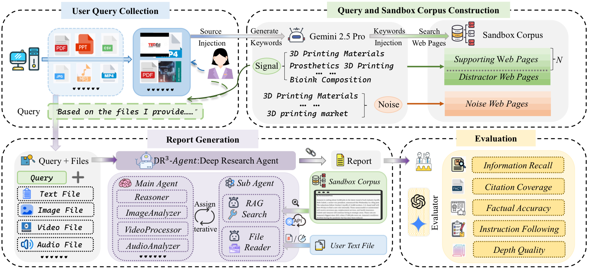
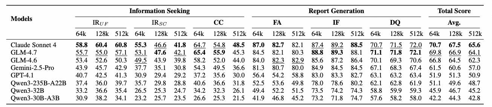
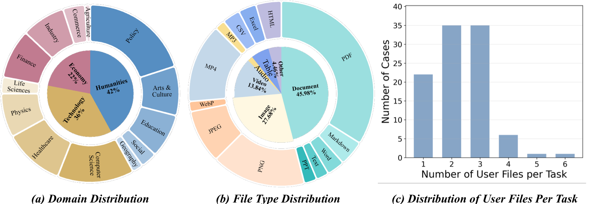
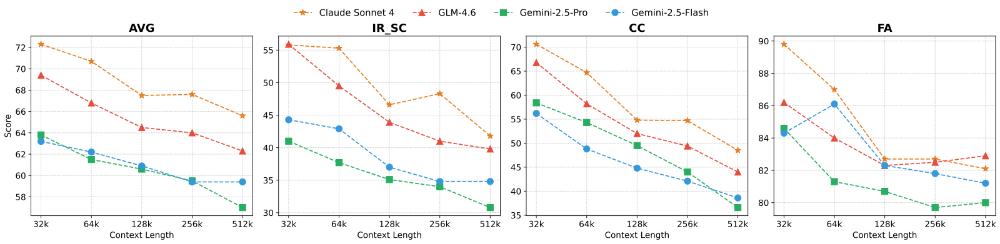

# DR3-Eval

DR3-Eval is a comprehensive evaluation framework and multi-agent research system for assessing the quality of AI-generated research reports. It processes document folders (PDFs, images, spreadsheets, etc.), generates structured research reports with citations, and evaluates them across multiple dimensions. It supports multiple LLM backends and provides fine-grained metrics for report quality assessment.

> 📌 This project is built upon the [MiroFlow](https://github.com/MiroMindAI/miroflow) framework by [MiroMind AI](https://github.com/MiroMindAI). We extend their work with the DR3-Eval evaluation framework, including multi-dimensional report quality metrics, benchmark support, and multi-model comparison capabilities.

## Framework



## Project Structure

```
├── main.py                     # Unified CLI entry point (run / batch)
├── eval.py                     # Batch evaluation runner
├── conf/                       # Hydra configuration (LLM, agent, benchmark)
├── src/                        # Core agent source code
│   ├── config/                 # Configuration management
│   ├── core/                   # Orchestrator and memory
│   ├── io/                     # Input/output and folder processing
│   ├── llm/                    # LLM client interfaces
│   ├── logging/                # Logging utilities
│   ├── runners/                # Task runners (folder_task, batch_tasks)
│   └── utils/                  # Prompt utilities and helpers
├── evaluators/                 # DR3-Eval evaluation metrics
│   ├── citation_coverage.py    # Citation quality and coverage
│   ├── depth_quality.py        # Report depth and quality
│   ├── factual_accuracy.py     # Factual correctness of claims
│   ├── format_compliance.py    # Checklist adherence
│   ├── information_recall.py   # Gold insight coverage
│   └── utils/                  # Shared evaluation utilities
├── run_scripts/                # Per-model bash scripts for batch runs
├── benchmarks/                 # Benchmark utilities and progress checkers
└── R3-Eval_datasets_example/   # Example dataset with sample tasks
```

## Prerequisites

- **Python 3.10+**
- **[uv](https://docs.astral.sh/uv/)** — fast Python package manager (recommended)
- API keys for at least one LLM provider (see below)

## Setup

### 1. Install dependencies

```bash
uv sync
```

### 2. Configure environment variables

```bash
cp .env.example .env
```

Edit `.env` and fill in the required API keys:

| Variable               | Required       | Description                       |
| ---------------------- | -------------- | --------------------------------- |
| `OPENROUTER_API_KEY` | **Yes**  | Primary LLM access via OpenRouter |
| `SERPER_API_KEY`     | Recommended    | Google Search for online research |
| `JINA_API_KEY`       | Recommended    | Web page scraping                 |
| `E2B_API_KEY`        | Recommended    | Linux sandbox for code execution  |
| `OPENAI_API_KEY`     | For evaluation | LLM-as-Judge in DR3-Eval          |

See `.env.example` for the full list of optional keys (audio, vision, reasoning models, etc.).

### 3. Verify installation

```bash
uv run python main.py --help
```

## Usage

### Run a Single Task

```bash
# Process a folder with a query
uv run python main.py run \
    --folder data/datasets_en/001 \
    --query "Analyze the documents and generate a research report."

# Offline mode (no web search, RAG only)
uv run python main.py run \
    --folder data/datasets_en/001 \
    --query "..." \
    --offline

# With Hydra config override
uv run python main.py run \
    llm=gpt-5 agent=evaluation_os \
    --folder data/datasets_en/001 \
    --query "..."
```

### Run Batch Tasks

```bash
# Run all tasks in a dataset with a specific model and context size
uv run python main.py batch \
    --data-dir data/datasets_en \
    --context-size 128k \
    --llm-config gpt-4 \
    --run-batch 20260108 \
    --offline
```

Or use the per-model scripts in `run_scripts/`:

```bash
bash run_scripts/run_gpt4.sh
```

### Evaluate Results

```bash
# Evaluate all models on a dataset
uv run python eval.py all \
    --result-base results_main/datasets_en \
    --datasets-dir data/datasets_en \
    --workers 4

# Evaluate specific models and metrics
uv run python eval.py all \
    --result-base results_main/datasets_en \
    --datasets-dir data/datasets_en \
    --include-models gpt-4.1 claude_sonnet4 \
    --metrics information_recall format_compliance \
    --workers 4
```

## Evaluation Metrics (DR3-Eval)

| Metric                 | Description                                     |
| ---------------------- | ----------------------------------------------- |
| `information_recall` | Coverage of gold insights from source documents |
| `format_compliance`  | Adherence to checklist requirements             |
| `citation_coverage`  | Quality and coverage of source citations        |
| `depth_quality`      | Holistic report depth and quality assessment    |
| `factual_accuracy`   | Factual correctness of cited claims             |

## Main Results



## Dataset Statistics



## Scale Results



## Acknowledgements

This project is built upon the [MiroFlow](https://github.com/MiroMindAI/miroflow) framework by [MiroMind AI](https://github.com/MiroMindAI). We extend their work with the DR3-Eval evaluation framework, including multi-dimensional report quality metrics, benchmark support, and multi-model comparison capabilities.

## License

Apache License 2.0 — see [LICENSE](LICENSE) for details.
